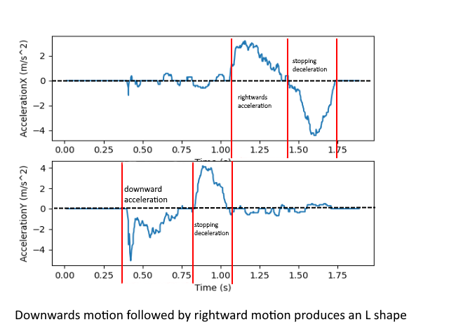
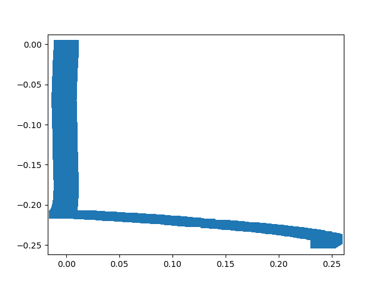

# Handwriting Recognition using Accelerometers
An automated method of obtaining graphs of letters or numbers using accelerometers.
## Method
This is done by drawing the desired character using a device containing an accelerometer on a flat surface, without rotating it. By using discrete triple integration, the recorded acceleration data can be converted into position data. Position data is visualized using horizontal vs. vertical position scatter plots as seen in the [Position folder](doc/Graphs/Position). 
## Usage
The included Python scripts allow one to select a .csv file containing previously recorded acceleration data from the data folder. The chosen data will be plotted depending on the chosen script, as seen below.

The [PlotAcceleration.py](src/PlotAcceleration.py) script plots the acceleration data, in both horizontal and vertical directions, over time.

The [PlotLetter.py](src/PlotLetter.py) script plots the horizontal vs. vertical position data. 
This forms a clear visual of the written character, with error arising mainly from horizontal accelerometer drift.

